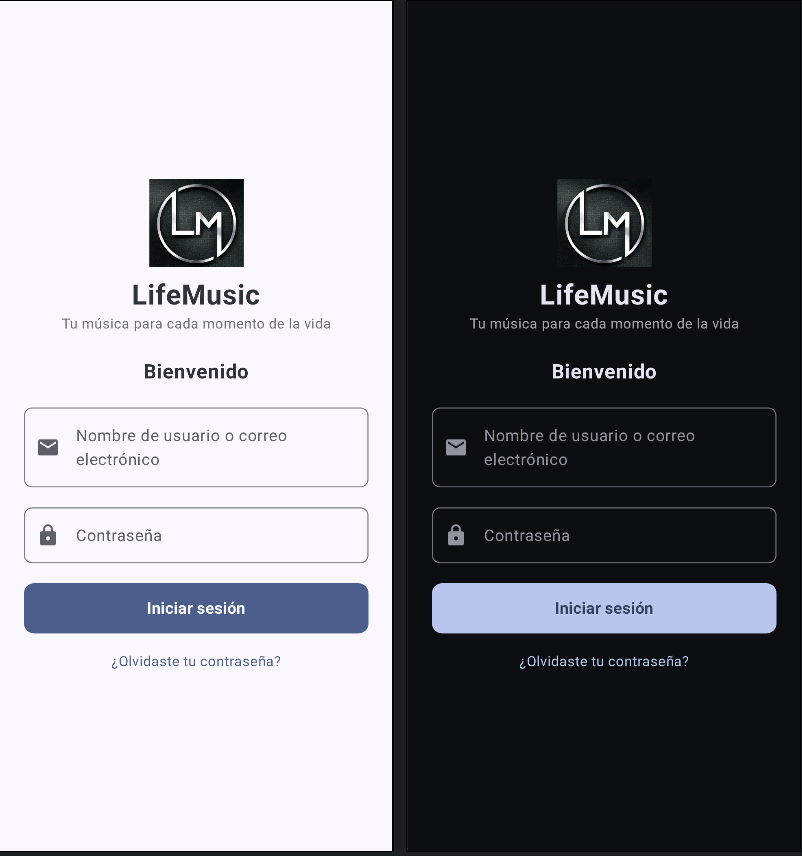
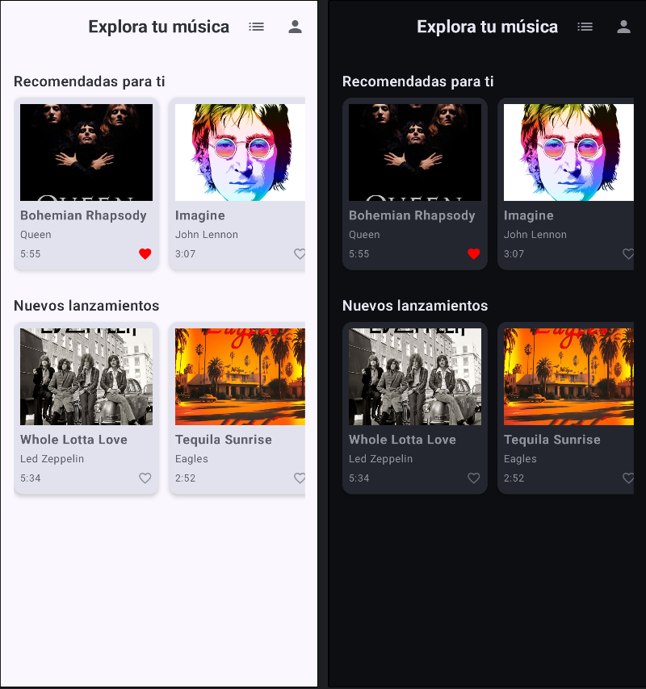
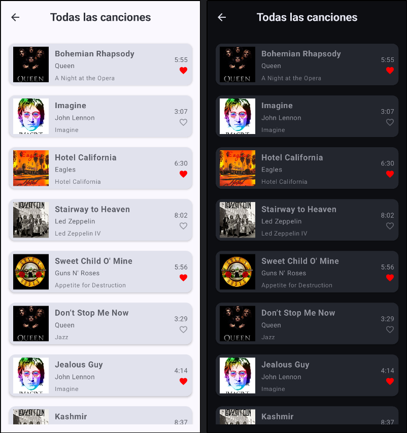
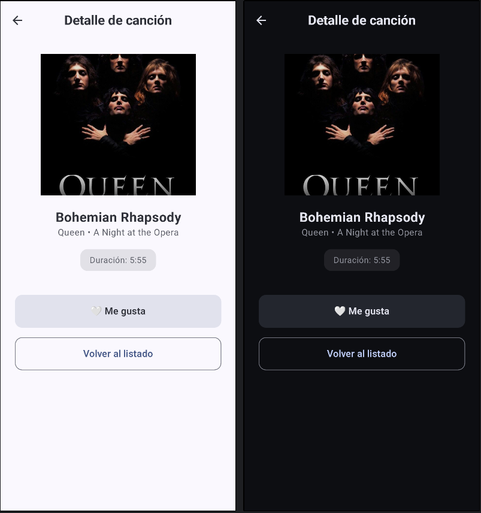
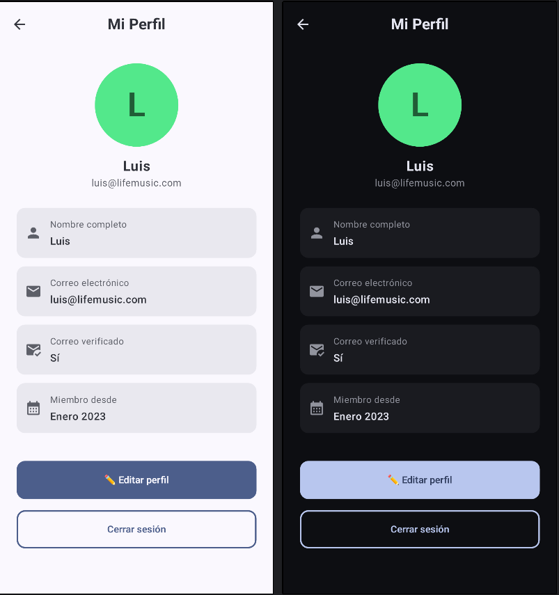

# 🎓 Proyecto Android – LifeMusic

**Autor:** Luis Darwin Prado Cisneros  
📅 *Trabajo individual por motivos laborales (horarios imprevisibles)*  
💻 *Desarrollado en Android Studio 2025 con Jetpack Compose y Material 3*

---

## 🧩 Parte 1 – Diseño de la App

**Tema elegido:** 🎵 Aplicación musical *LifeMusic*

El proyecto busca recrear una app moderna de música donde el usuario pueda iniciar sesión, explorar canciones recomendadas, ver detalles y gestionar su perfil personal.

**Páginas diseñadas:**
- **Página de login** – Donde el usuario introduce sus credenciales de acceso.  
- **Página inicial** – Pantalla principal que se muestra tras iniciar sesión.  
- **Página de listado** – Muestra un listado de canciones scrollable.  
- **Página de detalle** – Presenta información más completa de una canción.  
- **Página de perfil** – Permite al usuario modificar su nombre o correo.

En el diseño inicial se consideró la presencia de una **toolbar (TopAppBar)** integrada en todas las pantallas mediante el componente `MainScaffold`.

---

### 📱 Ejemplos visuales del diseño

#### 🟦 Página de Login
Pantalla de inicio de sesión con campos de texto, íconos y botón de acceso.



---

#### 🟩 Página Inicial (HomePage)
Pantalla principal con secciones de “Recomendadas para ti” y “Nuevos lanzamientos”.  
Se emplea `LazyRow` para mostrar canciones en tarjetas horizontales (`SongCard`).



---

#### 🟧 Página de Listado (ListPage)
Listado vertical de canciones usando `LazyColumn` y el componente `SongListItem`.



---

#### 🟥 Página de Detalle (DetailPage)
Muestra información detallada de una canción, con opciones de “Me gusta ❤️” y “Volver al listado”.



---

#### 🟨 Página de Perfil (ProfilePage)
Pantalla donde el usuario puede ver y editar su información, con campos editables y botones de acción.



---

## 🧱 Parte 2 – Identificación de Componentes

| Componente | Archivo | Parámetros | Descripción |
|-------------|----------|------------|--------------|
| `MainScaffold` | `MainScaffold.kt` | title, isHome, onBackClick, onListClick, onProfileClick | Estructura base con barra superior adaptable (inicio/subpantalla) |
| `SongCard` | `SongCard.kt` | imageRes, title, artist, duration, isFavorite | Tarjeta visual para canciones recomendadas |
| `SongListItem` | `SongListItem.kt` | imageRes, title, artist, album, duration, isFavorite | Elemento compacto de la lista vertical |
| `SongData` | `SongData.kt` | — | Lista compartida con 20 canciones de ejemplo |
| `ProfileInfoItem` | `ProfilePage.kt` | icon, label, value | Elemento informativo del perfil del usuario |

📘 Todos los componentes fueron definidos como `@Composable` y se implementaron **previews en modo claro y oscuro**.

---

## ⚙️ Parte 3 – Implementación

Se desarrollaron los composables definidos anteriormente, siguiendo las buenas prácticas de **Material Design 3**.

- Se usaron `remember` y `mutableStateOf` para los estados interactivos.  
- `LifeMusicTheme` gestiona automáticamente el modo claro/oscuro.  
- Cada componente incluye `@Preview` doble (Light y Dark).  
- Se crearon **data classes** para las canciones (`Song`) y una lista `sampleSongs`.  

Ejemplo de lista dinámica:

```kotlin
LazyColumn {
    items(sampleSongs) { song ->
        SongListItem(
            imageRes = song.imageRes,
            title = song.title,
            artist = song.artist,
            album = song.album,
            duration = song.duration,
            isFavorite = song.isFavorite
        )
    }
}
```

---

## 🖥️ Parte 4 – Páginas Implementadas

### 🟦 LoginPage
Campos de usuario y contraseña con validación visual.  
Incluye botón “Iniciar sesión” y texto clicable para recuperación de contraseña.

### 🟩 HomePage
Secciones horizontales con `SongCard`.  
Los íconos de lista y perfil aparecen en la barra superior.

### 🟧 ListPage
Lista completa con desplazamiento vertical (`LazyColumn`) y canciones provenientes de `SongData.kt`.

### 🟥 DetailPage
Muestra información detallada de la canción seleccionada.  
Incluye botones interactivos “❤️ Me gusta” y “Volver al listado”.

### 🟨 ProfilePage
Permite ver, editar y guardar información del perfil (nombre y correo electrónico).  
Contiene botones **Guardar cambios**, **Cancelar** y **Cerrar sesión**.

---

## 🌗 Tema y Apariencia

El tema `LifeMusicTheme` adapta todos los colores, textos y superficies a **modo claro y oscuro**, cumpliendo con las pautas de **Material Design 3**.

Cada pantalla posee un `@Preview` doble para validar ambos modos.

---

## 🧩 Estructura del Proyecto

```
com.luis.lifemusic/
│
├── component/
│   ├── MainScaffold.kt
│   ├── SongCard.kt
│   └── SongListItem.kt
│
├── page/
│   ├── LoginPage.kt
│   ├── HomePage.kt
│   ├── ListPage.kt
│   ├── DetailPage.kt
│   └── ProfilePage.kt
│
├── data/
│   └── SongData.kt
│
├── ui/theme/
│   ├── Color.kt
│   ├── Theme.kt
│   ├── Type.kt
│   └── Shape.kt
│
└── MainActivity.kt
```

---

## 🚀 Conclusión

El proyecto **LifeMusic** cumple con todas las fases del enunciado académico:

✔ Diseño visual con imágenes y barra superior.  
✔ Identificación clara de componentes y parámetros.  
✔ Implementación modular y reutilización eficiente del código.  
✔ Uso correcto de `Scaffold`, `LazyColumn`, `LazyRow` y `MaterialTheme`.  
✔ Previews en modo claro y oscuro.  

✨ *LifeMusic es una aplicación base funcional, visualmente coherente y preparada para integrar navegación y persistencia en futuras versiones.*
